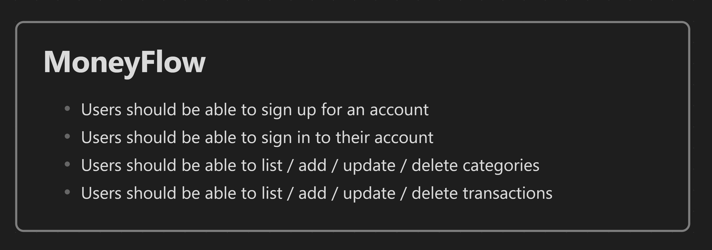
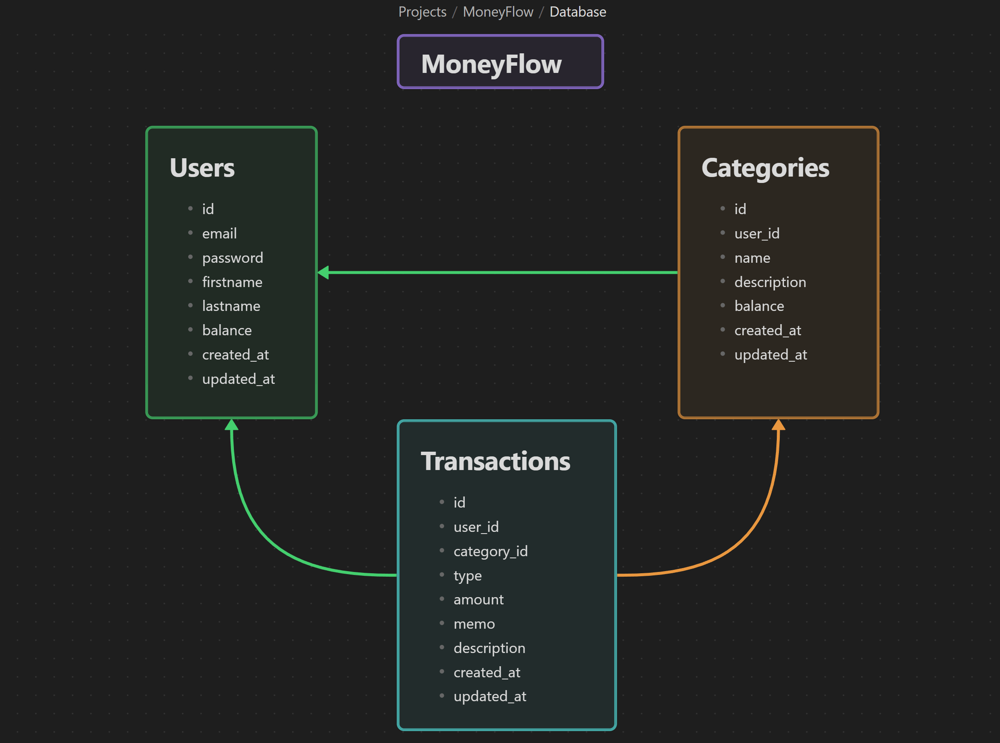
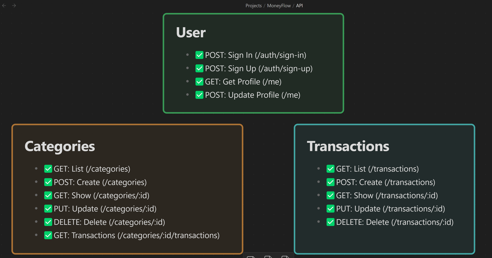

# Creating an API server in Rust with Actix, SQLx and JWT

## Section 1: Introduction

1. create project

```shell
cargo new moneyflow
```

2. add dependencies

```shell
cargo add actix-web
```

3. test actix-web

- run the server
```shell
cargo run 
```

- client access to the server
```shell
> curl http://localhost:8080/                                                                                                                        +
Hello world!%
> curl http://localhost:8080/hey                                                                                                                     +
Hey there!%
> curl -d "Hello ECHO" -X POST http://localhost:8080/echo                                                                                            +
Hello ECHO%
```

4. additional resources:

- Quick intro to Rust syntax: [Rust quick intro](https://fasterthanli.me/articles/a-half-hour-to-learn-rust)
- The Rust Book: [Rust book](https://doc.rust-lang.org/book/)
- Rust Cheatsheet: [Rust cheatsheet](https://cheats.rs/)
- A Gentle Introduction to Rust: [rust-gentle-intro](https://stevedonovan.github.io/rust-gentle-intro/)

## Section 2: MoneyFlow

1. MoneyFlow requirement


2. Database Structure


3. API Design


## Section 3: Database Setup with SQLx

1. install sqlx-cli via this [link](https://github.com/launchbadge/sqlx/tree/main/sqlx-cli)
```shell
cargo install sqlx-cli
```
- verify by
```shell
sqlx -V
```
- add dependency
```toml
sqlx = { version = "0.8", features = [ "runtime-tokio", "tls-rustls","mysql","chrono" ] }
```